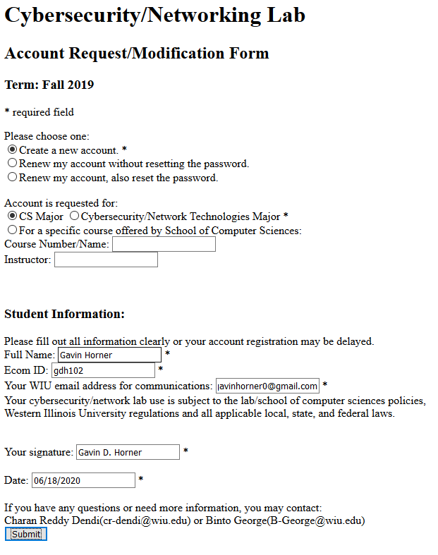
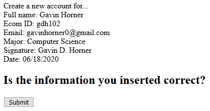

# README
Web Application using LAMP for a Cybersecurity lab that creates users through forms and stores their data.

## AUTHOR
Gavin Horner

gavinhorner0@gmail.com

## USAGE
Once on the form.php page, fill out the form as needed and click submit. You will then be prompted for confirmation, if confirmed, then you will be taken to the submission page and sent an email that it worked correctly. A query will also be created within the table containing all of your given information. 

## ABOUT
This program is useful for quickly retrieving, checking, storing, and sending user data. These four processes happen very quickly with the only thing being required of the user is to input their data. It is much more efficient than a traditional paper copy application, and also more reliable.
